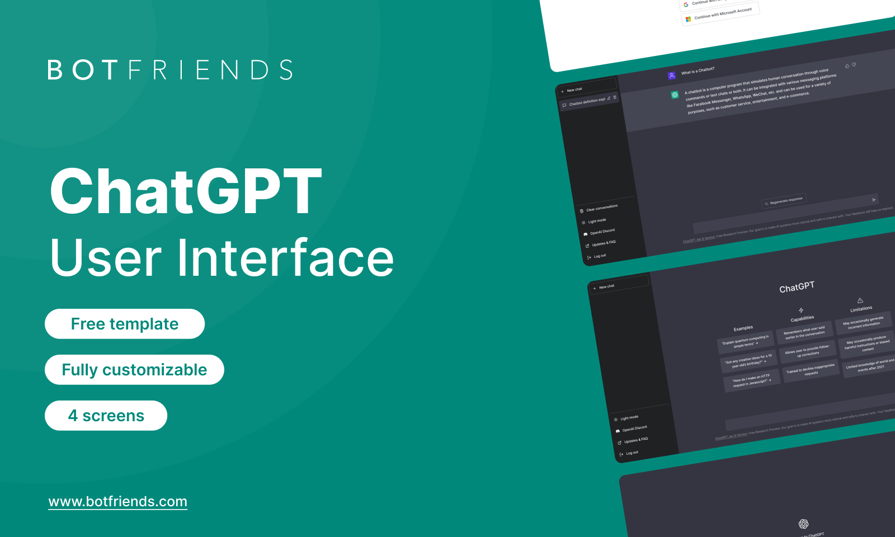
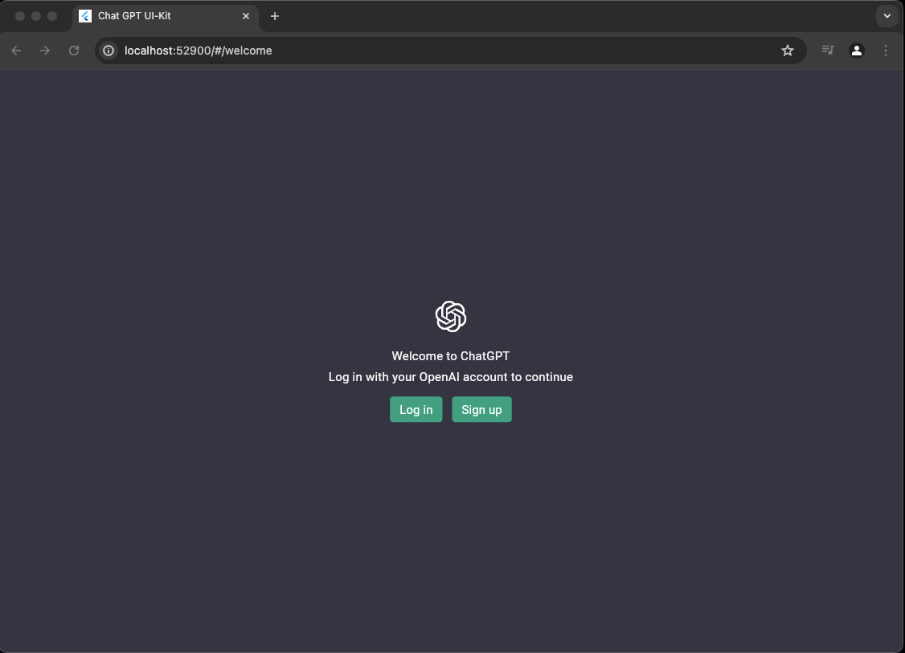
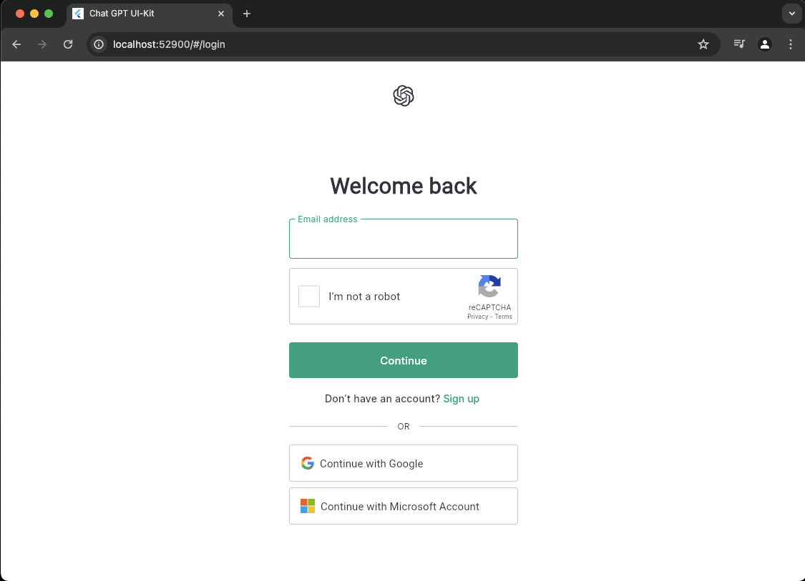
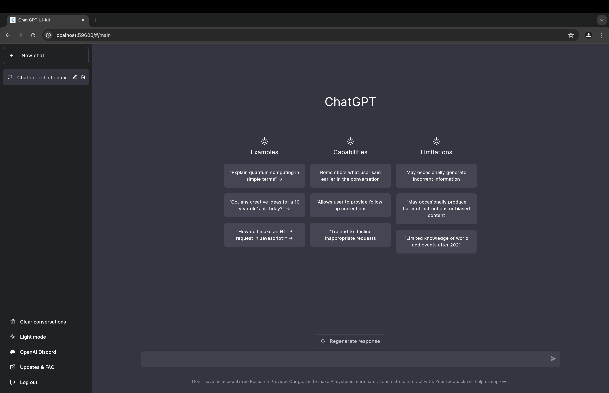
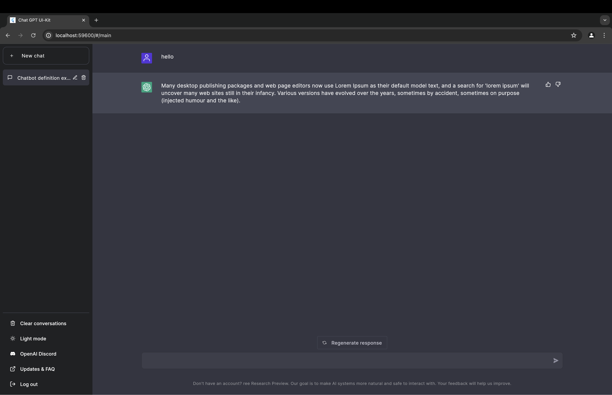

# ChatGPT Web Ui-Kit

Simple chat UI kit.

## 📸 Banner

 
## features

[x] Splash screen
[x] Welcome screen
[x] Login screen
[x] Main UI
[x] Start screen
[x] Go router
[x] Riverpod

## 📸 Screenshots

- welcome

- login
  

- home
  

- chat
  
